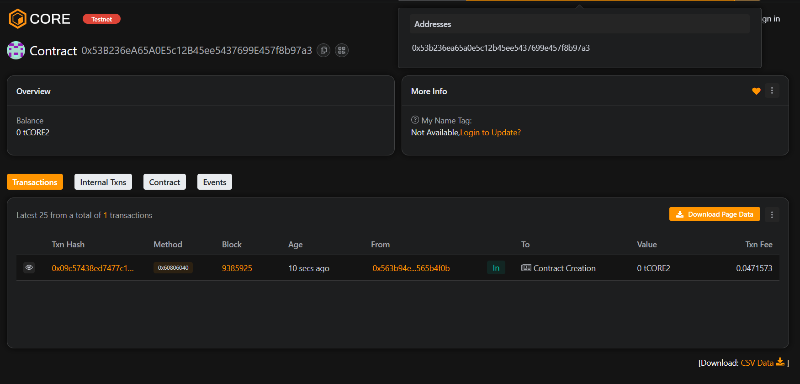

# 🪙 LedgerBridge

## 📝 Project Description
LedgerBridge is a blockchain-based decentralized ledger that allows users to securely record, verify, and view transactions without relying on centralized systems. It ensures full transparency and immutability of all recorded transactions.

---

## 🎯 Project Vision
To create a transparent, trustless, and decentralized financial ledger that bridges users globally with secure and immutable transaction records.

---

## ⚙️ Key Features
- Record transactions securely on-chain  
- Retrieve transaction details anytime  
- Fully transparent ledger with timestamp tracking  
- Event-driven transaction logging  

---

## 🚀 Future Scope
- Integration with decentralized finance (DeFi) protocols  
- Cross-chain transaction support  
- AI-powered transaction analytics  
- Mobile DApp version for easy access  

---

## 🧰 Tech Stack
- Solidity (Smart Contracts)  
- Hardhat (Development Environment)  
- JavaScript (Testing & Deployment)  
- Ethereum Blockchain  

---

## 📜 License
This project is licensed under the MIT License.

Contract Add :  0x53B236eA65A0E5c12B45ee5437699E457f8b97a3

